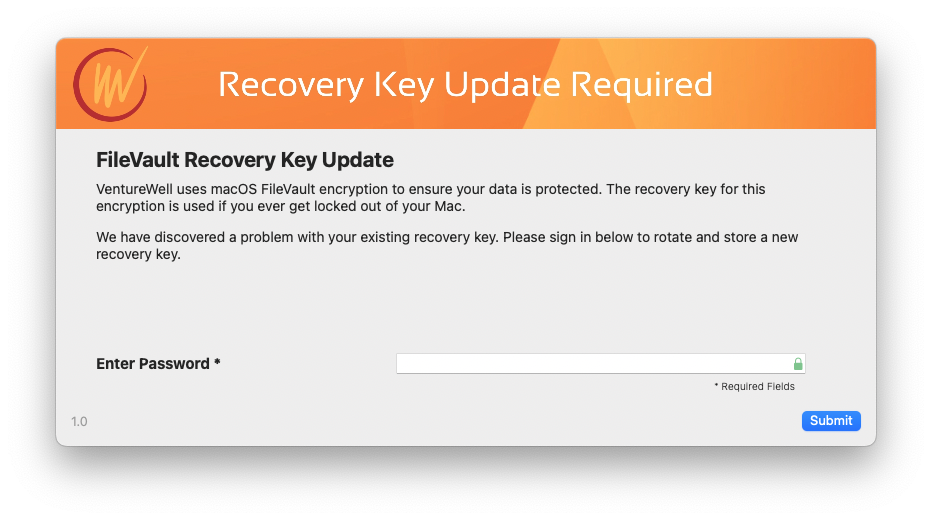

# Reissuing FileVault keys with Jamf
_based on https://github.com/homebysix/jss-filevault-reissue_

_Update to support SwiftDialog by Tom Bartlett - VentureWell - October 21, 2022_

This tool provides a nice user interface to rotate FileVault recovery keys. It uses the great SwiftDialog tool: https://github.com/bartreardon/swiftDialog

## How to Use
Scope to users who do not have FileVault keys stored or verified and set it to send once a day. Users will receive the following prompt to sign-in and once they do the script will attempt to rotate the FileVault key and re-escrow to Jamf.

# Security
- Check is run to ensure no remote users are connected. 
- Variable temporarily contains user password and generates a plist to authenticate with FileVault
- Variable in unset
